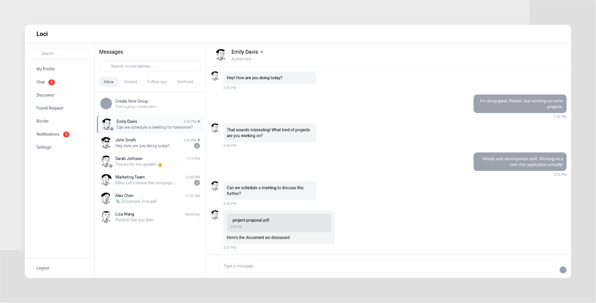
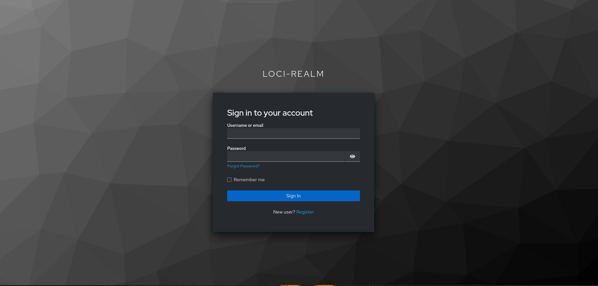
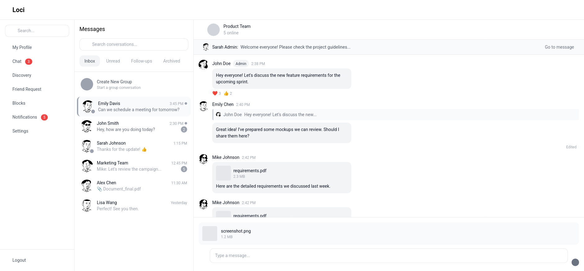
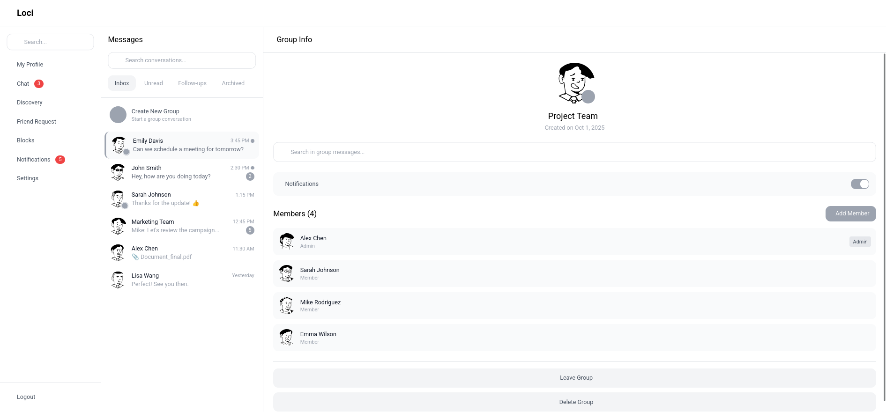
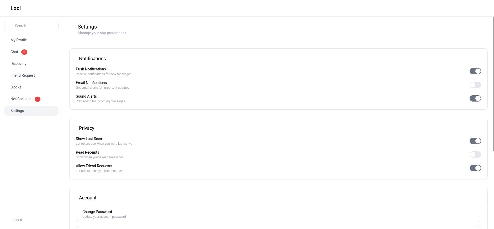
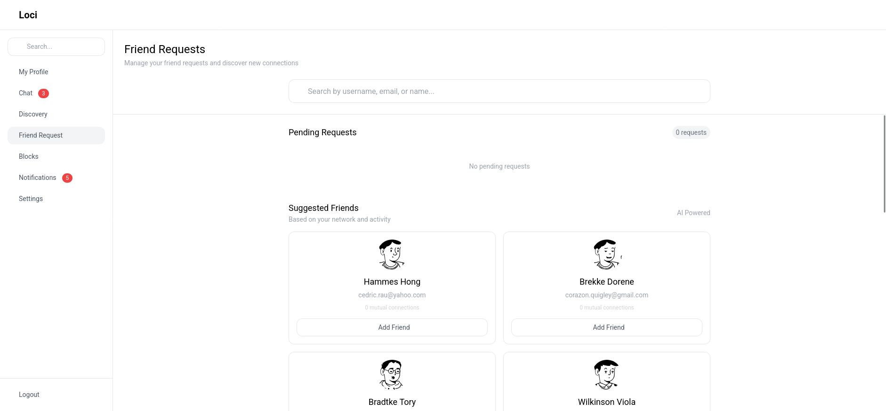
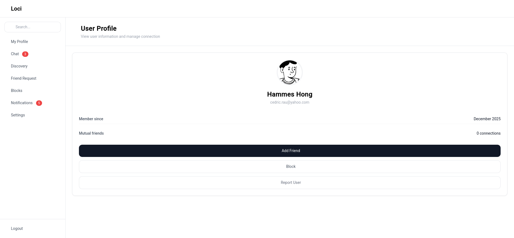
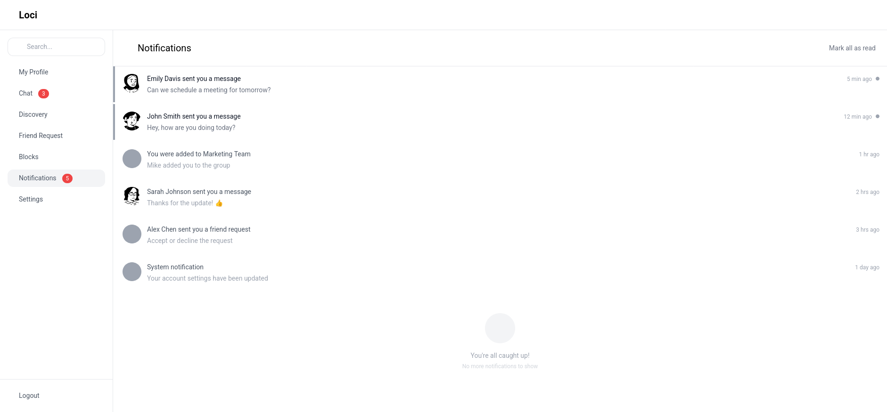

# Loci
### Connect Instantly, Communicate Effortlessly

  

  
  
  
  
  

  A modern, real-time messaging platform inspired by WhatsApp's simplicity and reliability, built with enterprise-grade technologies for fast and secure communication.

  <a href="#features">Features</a> •
  <a href="#about">About</a> •
  <a href="#screenshots">Screenshots</a> •
  <a href="#architecture-overview">Architecture Overview</a> •
  <a href="#tech-stack">Tech Stack</a> •
  <a href="#contributing">Contributing</a> •
  <a href="#license">License</a>

---

## Features 

| Feature               | Description                                                  |
| --------------------- | ------------------------------------------------------------ |
| Secure Authentication | Register and log in securely with customizable profiles for a personalized experience. |
| Real-Time Messaging   | Enjoy instant one-on-one chats with lightning-fast delivery and seamless syncing. |
| Group Chats           | Create and manage groups effortlessly, connecting multiple users in one conversation. |
| Media Sharing         | Send text, images, videos, files, and locations to enrich your conversations. |
| Message Status        | Track messages with real-time sent, delivered, and read indicators. |
| Push Notifications    | Get instant alerts for new messages, even when the app is in the background. |
---

## About

Loci bridges communication gaps by delivering fast, reliable, and secure messaging. Inspired by WhatsApp, it eliminates delays and frustrations, ensuring your messages reach loved ones, teams, or communities without fail.

Loci stands out with its robust enterprise-grade architecture using Spring Boot for the backend and Angular for the frontend. This combination prioritizes performance, scalability, and real-time capabilities, making it ideal for developers learning modern web technologies or building production-ready applications.

Whether you are connecting with family, collaborating with colleagues, or engaging in community discussions, Loci serves as your intuitive communication hub—simple yet powerful.

---

## Screenshots

  

  

---

## Architecture Overview

Loci follows **Domain-Driven Design (DDD)** combined with **Hexagonal Architecture** (Ports and Adapters). 

## Tech Stack

### Backend
- Spring Boot 3.x
- Spring Security + Keycloak
- Spring WebSocket/STOMP
- Spring Data JPA
- PostgreSQL
- Maven
- Minio for Aws SDK compatible

### Frontend
- Angular 17+
- RxJS for reactive streams
- RxStomp for provide STOMP.js with RxJS style API

### DevOps
- Docker for containerization
- Jenkins for CI/CD

---

## Contributing

We ❤️ contributions! Whether fixing bugs, adding features, or improving docs, your help makes Loci better.

- Follow Java (Spring) and Angular style conventions
- Fork the repo and create a feature branch
- Submit Pull Requests with clear descriptions
- Report issues via GitHub issues

## License
Loci is open-source under the MIT License. Use it freely, but give credit where due.

---

  <strong>Built with ❤️& ☕ by Trung Kien</strong>

